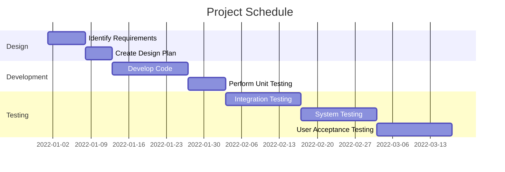

<h3 align="center">Engineer Job Times | Status: Complete</h3>

## Objective Supported
- Efficiency and cost savings

<!-- TABLE OF CONTENTS -->

  
Table of Contents

  <ol>
    <li>
      <a href="#project-overview">Project Overview</a>
    </li>
    <li>
      <a href="#initial-mvp-breakdown">Initial MVP Breakdown</a>
    </li>
    <li>
      <a href="#business-metric/s-targetted">Business metric/s targetted</a>
    </li>
    <li>
      <a href="#stakeholders-&-ceremonies">Stakeholders & Ceremonies</a>
    </li>
    <li>
      <a href="#additional-items-for-definition-of-ready">Additional Items for Definition of Ready</a>
    </li>
    <li>
      <a href="#high-level-process-documentation">High level process documentation</a>
    </li>
    <li>
      <a href="#data-location-/-details">Data location / Details</a>
    </li>
    <li>
      <a href="#detailed-process-documentation">Detailed process documentation</a>
    </li>
  </ol>

## TL;DR:

Productionisation of an end-to-end machine learning model built using Azure ML and Databricks, reducing allocated engineer job times by 15%, saving £2million per annum, driving efficiencies and cost savings.

## Project Overview:
| Work Stream | Project Title | High Level Description | Type | Indicative business value | Initial timescale | Long Term Goal | Date Raised |
| -----------: | :-----------: | :-----------: | :-----------: | :-----------: | :-----------: | :-----------: | :-----------: |
| Planning | Job Time Estimation (Engineer Field Strategy) | Optimising engineer job times  | Production | £2 million | 5 months | A soft and hard trial, based on experimental design, looking to change engineer job times | '22 |

## Initial MVP Breakdown:
- MVP 1: Soft Trial ; introducing new job times for Gas Repair across a patch
- MVP 2: Hard Trial ; introducing changes for Gas Service and Gas Repair for multiple patches / region 
- MVP 3: Producing a model that caters for variation in type of part installed / brand of a customers boiler  

## Business metric/s targetted:
|  | 🤬 Complaints | ☎️ Contact | 🚦 NPS | 📆 Reschedules | 📊 Solver/RFT/FTF | ⏳ Efficiency/FTE | 💻 OAM |
| -----------: | :-----------: | :-----------: | :-----------: | :-----------: | :-----------: | :-----------: | :-----------: |
| Increase 🔼 / 🔽 Reduction |  |  |  | ✔️ |  | ✔️ |  |

_________________________

## Stakeholders & Ceremonies

*✔️: Required, 💬: Optional Invite, ❌: Not required*

| Event | 👨‍👩‍👦 Project Team | 👨‍🏫 Project Lead | 🗝️ Product Owner | 👨‍💻 Manager | 👩‍💼 Senior Manager | 🕵️‍♀️ Subject Matter Expert (SME)|
| -----------: | :-----------: | :-----------: | :-----------: | :-----------: | :-----------: | :-----------: |
|  |  |
| **Backlog Planning & Refinement** | 💬 | ✔️ | ✔️ | 💬 | 💬 | ❌ |
| **Action (Task) Planning** | 💬 | ✔️ | ❌ | 💬 | ❌ | ❌ |
| **Stand-up** | ✔️ | ✔️ | ❌ | ✔️ | ❌ | ❌ |
| **Sprint Review** | ✔️ | ✔️ | ✔️ | ✔️ | ✔️ | ❌ |
| **Retrospective** | ✔️ | ✔️ | ❌ | 💬 | ❌ | ❌ |
| **Team Meeting** | ✔️ | ✔️ | ❌ | ✔️ | 💬 | ❌ |
| **DS Workshop** | ✔️ | ✔️ | ❌ | ✔️ | ❌ | ❌ |

_________________________

## Additional Items for Definition of Ready:
| Item | Details | Notes / Mitigation (Optional) |
| -----------: | :-----------: | :-----------: | 
| Data location/s identified | ✔️ | [comment] |
| Data location/s accessible | ✔️ | Accessible through DB |
| Labour resource needed (eg # Data Scientists) | 1 x Lead, 2 x Data Scientists |  [comment] |
| Technical Resource needed () | Databricks, Azure ML | [comment] |
| Technical Skillset required | PySpark  | [comment] |
| Personal/Sensitive Data Used | ✔️ | Data obviscated and stored in locked down container  |
| Privacy Impact Assessment Required | ✔️ | PIA Ref: ****|
| Tangible output | Field trial with new job times implemented and succesful roll out across patches | 15% Job time reduction |

_________________________

## High level process documentation:
**Project Intent : -**  
****

- This project was born from the understanding that engineer job time predictions are taken from a non-dynamic static "lookup table"
- No accountabiity was made previously for an engineers' specific patch, the time of year, weather etc ...
- The ask is to build a dynamic job times model catering to each specific patch; accounting for various factors
- NB: This needs to be performed so not as to upset existing engineers in making them feel threatened or watched   

**Business value: -**  
****

- Engineers have more capacity with more accurate job time predictions. More jobs booked per day
- Reduces engineer reschedules if too many jobs are booked. Fewer reschedules, better efficiency, happier customers

## Project Results -**
****

- Reduced allocated engineer job times by 15%
- Savings of roughly £2 million per annum
- Presented at Director level and senior leadership

****

## Project Schedule

The following is a Gantt chart outlining the schedule for the project:

